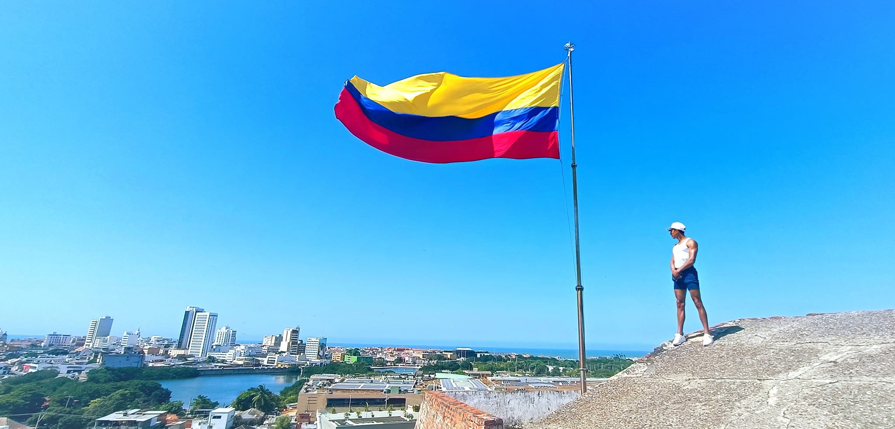

# :octocat:**Presentación**:octocat:
___

___
## **Datos generales:**
___
  - **Nombre:** Oscar Ignacio Mendoza Cardozo
  - **Edad:** 30 años 🧑
  - **Profesion:** Fonoaudiólogo  👨‍⚕️
  - **Estudio actual:** MSc en Epidemiología 👨‍🔬 📊 [Universidad de Antioquia](https://n9.cl/yaacj).
  - **Empleo:** Asistente de investigacion, Universidad de Antioquia.
## **Pasatiempos:**
___

  1. Viajar
  2. Explorar la gastronomia de diferentes lugares
  3. Hacer ejercicio
  4. Leer libros de tecnología e inovación 

___
***Material guia:***
- https://stackedit.io/app#

